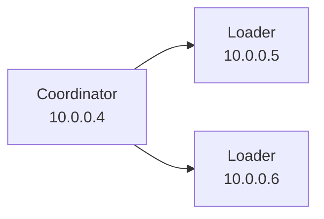

# ESRally

This repository provides a quick-start guide on how to effectively use Elasticsearch Rally for load testing. It includes step-by-step instructions and best practices for setting up and running tests with Rally, as well as troubleshooting tips for common issues that may arise during the process.

##  1. <a name='Tableofcontents'></a>Table of contents

<!-- vscode-markdown-toc -->
* 1. [Table of contents](#Tableofcontents)
* 2. [Installation](#Installation)
	* 2.1. [Docker ESRally](#DockerESRally)
	* 2.2. [ESRally Dashboard](#ESRallyDashboard)
	* 2.3. [Annotations](#Annotations)
		* 2.3.1. [Add timestamp](#Addtimestamp)
* 3. [Usage](#Usage)
	* 3.1. [Single injector](#Singleinjector)
	* 3.2. [Advanced Architecture : Dedicated Injection Architecture](#AdvancedArchitecture:DedicatedInjectionArchitecture)
		* 3.2.1. [Run the benchmark](#Runthebenchmark)
	* 3.3. [Troubleshooting](#Troubleshooting)

<!-- vscode-markdown-toc-config
	numbering=true
	autoSave=true
	/vscode-markdown-toc-config -->
<!-- /vscode-markdown-toc -->

##  2. <a name='Installation'></a>Installation

###  2.1. <a name='DockerESRally'></a>Docker ESRally

As a matter of effectivness, we are recommanding to use [esrally](https://hub.docker.com/r/elastic/rally) [Docker](https://www.docker.com/) image to run ESRally. If you are looking after advanced scenario with a dedicated load testing architecture using `esrallyd`, you should use the vanilla python version of ESRally.

```bash
docker pull elastic/rally
```

###  2.2. <a name='ESRallyDashboard'></a>ESRally Dashboard

In order to have a dashboard to visualize the results of ESRally, you can import [ESRally Kibana Dashboard](https://github.com/Abmun/rally-apm-search/blob/master/Rally-Results-Dashboard.ndjson) dashboard or use the one provided as part of this repository.
To import it, you will have to go to Stack Management. Click on "Create Saved Object" and select "Import" under Kibana menu. Then click on "Upload Kibana Saved Objects". Finally paste the content of [Rally-Results-Dashboard.ndjson](https://github.com/Abmun/rally-apm-search/blob/master/Rally-Results-Dashboard.ndjson) file in the text area and click on "Import".

### Rally.ini

In order to run ESRally, you will have to provide a `rally.ini` file that contains all the information about your cluster and the benchmark you want to run. You can find an example of this repository.

In order to run get the results in the dashboard, you will have to adapt the `reporting` section with your Elasticsearch configuration:

```bash
[reporting]
datastore.type = elasticsearch
datastore.host = [$ELASTIC_HOST]
datastore.port = $ELASTIC_PORT
datastore.secure = true
datastore.user = $ELASTIC_USE
datastore.password = $ELASTIC_PASSWORD
```


###  2.3. <a name='Annotations'></a>Annotations

Finally, if you want to add some annotation, we will use the annotation feature to enhance kibana's dashboard we previously imported.
This feature is undocumented inside esrally and partially implemented, so you'll need to do additional steps to make it work.

####  2.3.1. <a name='Addtimestamp'></a>Add timestamp

To do so, you need to add a new pipeline in Kibana. In Kibana's dev go to "Management" -> "Dev Tools" and then in the "Console" tab type the following command:

```bash
PUT _ingest/pipeline/add_timestamp
{
  "description": "Adds timestamp",
  "processors": [
    {
      "set": {
        "field": "@timestamp",
        "value": "{{_ingest.timestamp}}"
      }
    }
  ]
}
```


```bash
PUT rally-annotations/_settings
{
  "index": {
    "default_pipeline": "add_timestamp"
  }
}
```

##  3. <a name='Usage'></a>Usage

###  3.1. <a name='Singleinjector'></a>Single injector

If you are using a single injector through Docker, you will have to use the following command :

```bash
docker run -ti -v "./rally.ini:/rally/.rally/rally.ini" elastic/rally race --track=metricbeat --target-hosts=$ELASTIC_ENDPOINT --pipeline=benchmark-only --client-options="use_ssl:true,verify_certs:true,basic_auth_user:'$ELASTIC_USER',basic_auth_password:'$ELASTIC_PASSWORD'""
```

**Explanation**
-v : mount the rally.ini file in the container.
-ti : run the container in interactive mode.
--track=metricbeat : choose the track to benchmark.
--target-hosts= : choose the cluster to benchmark.
--pipeline=benchmark-only : choose the pipeline to benchmark.
--client-options="use_ssl:true,verify_certs:true,basic_auth_user:'$ELASTIC_USER',basic_auth_password:'$ELASTIC_PASSWORD'" : choose the authentication.


###  3.2. <a name='AdvancedArchitecture:DedicatedInjectionArchitecture'></a>Advanced Architecture : Dedicated Injection Architecture

In order to have a better control of the benchmark, you can use a dedicated architecture. As per the documentation you can't use docker environement, so you'll need to install on the operating system directly.

The following tutorial will be running against an Ubuntu environment with 3 nodes:



On each node you'll need to install esrally:

```bash
sudo su -
apt update
apt install -y python3-full python3-pip
python3 -m venv esrally/venv
source esrally/venv/bin/activate
pip install esrally
```

Once done, you can start the esrally coordinator with the following command:

```bash
esrallyd start --node-ip=10.0.0.4 --coordinator-ip=10.0.0.4
```

On the loader nodes:

```bash
esrallyd start --node-ip=10.0.0.5 --coordinator-ip=10.0.0.4
esrallyd start --node-ip=10.0.0.6 --coordinator-ip=10.0.0.4
```

Validate it's working by running the following commands on the coordinator node:

```bash
python3 -m thespian.shell
start multiprocTCPBase
address localhost 1900
status
```

and you should see the attendes connected to the coordinator.

```bash
...
 |Convention Attendees [2]:
    @ ActorAddr-(T|10.0.0.5:1900) [#1]: Expires_in_0:21:39.120535
    @ ActorAddr-(T|10.0.0.6:1900) [#2]: Expires_in_0:22:00.601589...
```

####  3.2.1. <a name='Runthebenchmark'></a>Run the benchmark

Now that you have the cluster up and running, you can run a benchmark.

```bash
esrally add annotation --track=$ESRALLY_TRACK --message="start race $ESRALLY_RACE" --race-timestamp=`date -u +"%Y%m%dT%H%M%SZ"`
esrally race --track=$ESRALLY_TRACK --telemetry=node-stats --load-driver-hosts=10.0.0.7,10.0.0.8 --target-hosts=$ESRALLY_ENDPOINT --pipeline=benchmark-only --client-options="use_ssl:true,verify_certs:true,basic_auth_user:'elastic',basic_auth_password:'$ESRALLY_PASSWORD'" --report-file="$ESRALLY_RACE.md" --user-tags="race:$ESRALLY_RACE"
esrally add annotation --track=$ESRALLY_TRACK --message="end race $ESRALLY_RACE" --race-timestamp=`date -u +"%Y%m%dT%H%M%SZ"`
```

###  3.3. <a name='Troubleshooting'></a>Troubleshooting

If you want to look after the logs of the cluster, you'll find them in `~/.rally/logs/rally.log` on each node.
